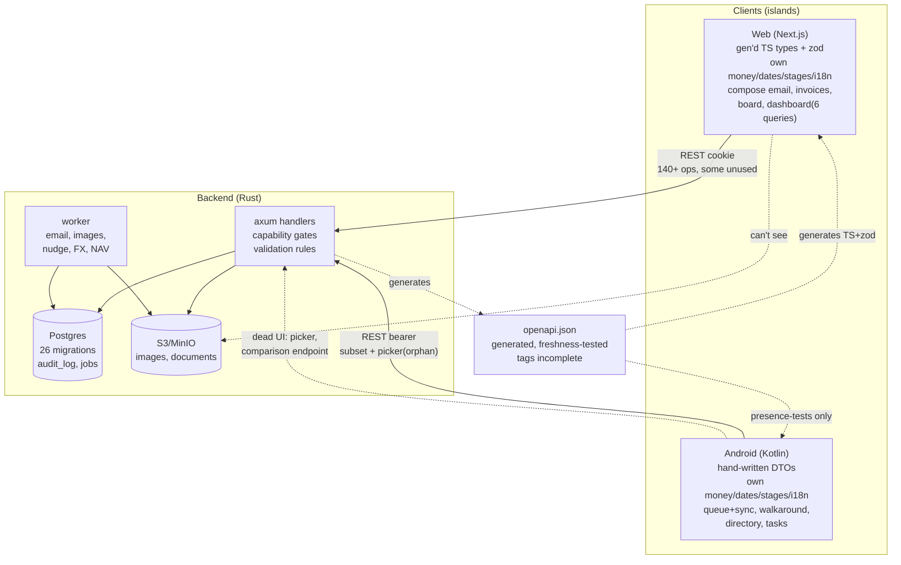
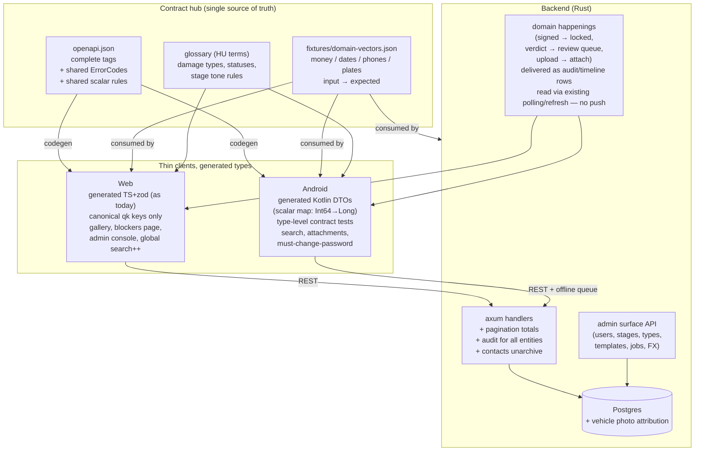

# 03 — Target architecture

How the system should look if designed as one product. Conventions: `B:` backend,
`F:` frontend, `A:` Android. Finding IDs refer to `02-findings.md`.

## Current architecture (as built)

Reads: two clients share one REST surface and one contract file, but each carries its own
copies of money, dates, stages, roles, strings, and error text; large parts of the surface
(blockers/admin/vehicles/reports/templates/users) are served but have no UI, while client-only
compositions (dashboard, board) can never be shared.

## Proposed architecture (contract-first hub)

## Single source of truth per entity

| Entity | Source of truth | Sharing mechanism |
|---|---|---|
| All rows + enums | Postgres migrations (`B:migrations/`) | unchanged |
| Wire shapes | `openapi.json` generated from handlers | unchanged, but tags completed (E4) |
| TS types + runtime validation | generated `schema.gen.ts` + `zod.gen.ts` | unchanged (already strong) |
| Kotlin DTOs | **generated**, not hand-written | openapi-generator (Kotlin + kotlinx.serialization) with scalar map `int64→Long, int32→Int, date→String`; deletes the hand-written `Dto.kt` drift surface (A3) |
| Error codes | new `ErrorCodes` section in the OpenAPI doc (or `docs/error-codes.md` generated from `B:src/error.rs`) | all three render from the catalog; unknown codes fall back to one generic line (A4, F2) |
| Money/dates/phones/plates | `fixtures/domain-vectors.json` in repo root | consumed by Rust unit tests, vitest, and JVM tests — same inputs, same expectations (F1) |
| HU glossary | `docs/glossary.md` (damage types, verdicts, statuses, kinds) + `hu.json` stays web's file | Android strings move to `strings.xml` + product flavors reference the glossary; new terms added in one place (D4) |
| Design tokens | `docs/design-tokens.md` (palette hexes, light + dark ramp) | web Tailwind config + Android `Theme.kt` both cite it; dark-mode-on-web becomes an explicit yes/no (D5) |

## Unified cross-cutting approaches

- **Errors**: every backend `Rule`/`Conflict` code registered in the catalog with HU + EN text and a `retryable` bit; web `errors.ts` and Android `Errors.kt` generated or table-driven from it; Android maps 400→Rule like the web.
- **Auth/session**: keep cookie+bearer split (correct per platform) but unify recovery journeys — password change on Android (C3), sessions UI on web (C12), one documented session-lifetime table.
- **Pagination**: backend returns `{items, total?}` (count query, cached where expensive) or cursor; both clients delete their "backend gap" hacks (F3).
- **Validation**: backend owns rules; clients pre-validate from generated schemas where possible; backend codes are the only machine interface (F2).
- **Offline**: Android queue stays the reference implementation; web documents "online-only, fail loudly" (D3) — no fake parity.
- **Logging/diagnostics**: backend audit extended to all entities (C11); Android gets crash reporting + contract-violation breadcrumbs (ties into A3 enforcement).
- **State/caching**: web keeps React Query with canonical `qk` keys only (lint-enforced); Android keeps StateFlow+Room, adds HTTP `total` handling; dashboard composition stays web-only but reads the same endpoints (C10 documented).

## Event/data flows that should connect features

No push infrastructure exists and none is proposed (explicitly out of scope in `04-roadmap.md`).
"Events" below are **audit/timeline rows and list endpoints the clients already poll or
re-read** — delivery means *written where clients look*, not pushed:

- `upload completed` → inspection attach (already works on Android; web gallery subscribes to
  the same read endpoints via normal query refetch — C1).
- `stage changed` → email + timeline (exists server-side; surfaces: web audit + Android history
  via `GET /orders/{id}/audit` and detail refetch — C11 extends it to lead/partner).
- `inspection signed` → lock + order timeline entry (new: audit `inspection/sign` so the web
  order page shows it on its next `qk.order` refetch, no second query).
- `verdict=new` → review queue surfaced on the web comparison view (exists) **and** a
  tasks-style attention list (new; feeds C4) — both plain list reads, refreshed on open and by
  the existing pull-to-refresh, same as every other list.
- `blocker created/resolved` → order timeline + board attention (new; feeds C2) — the board
  already polls every 30s (`F:src/components/board/PickupBoard.tsx:25`), invoices every 3s
  while `submitting`; no new transport, just new rows to poll.
- `job failed` → admin console entry (new; feeds C8), read on open — log-only today.

In short: the "event bus" is Postgres plus the existing polling/refresh rhythms. If a future
requirement needs true push (e.g. dispatcher alerts), that is a new infrastructure decision,
not an extension of this plan.

## What moves or dies

- **Moves into backend**: pagination totals, contacts unarchive, audit reads for lead/partner, expiry/attention derivations (email attention filter moves server-side so both clients share it), money-total cross-check already there.
- **Moves into shared fixtures**: money/date/phone/plate vectors; error-code catalog; glossary; design tokens.
- **Deleted**: order picker UI + `/mobile/orders` unless rewired (E1 — decision required, see roadmap step 2); sticky `currentOrder`; dead `comparison` field/endpoint duplication (E3); unused composables/keys/imports (E4); unreferenced `lead_acknowledgement` template or wire it; `order_specs::delete` or wire it; migration `0023` gap documented or filled.
- **Stays deliberately split**: CameraX vs system camera (evidence quality vs guidance), offline queue (shop floor only), charts (desktop), dark theme (phone), Hungarian-only (both).
